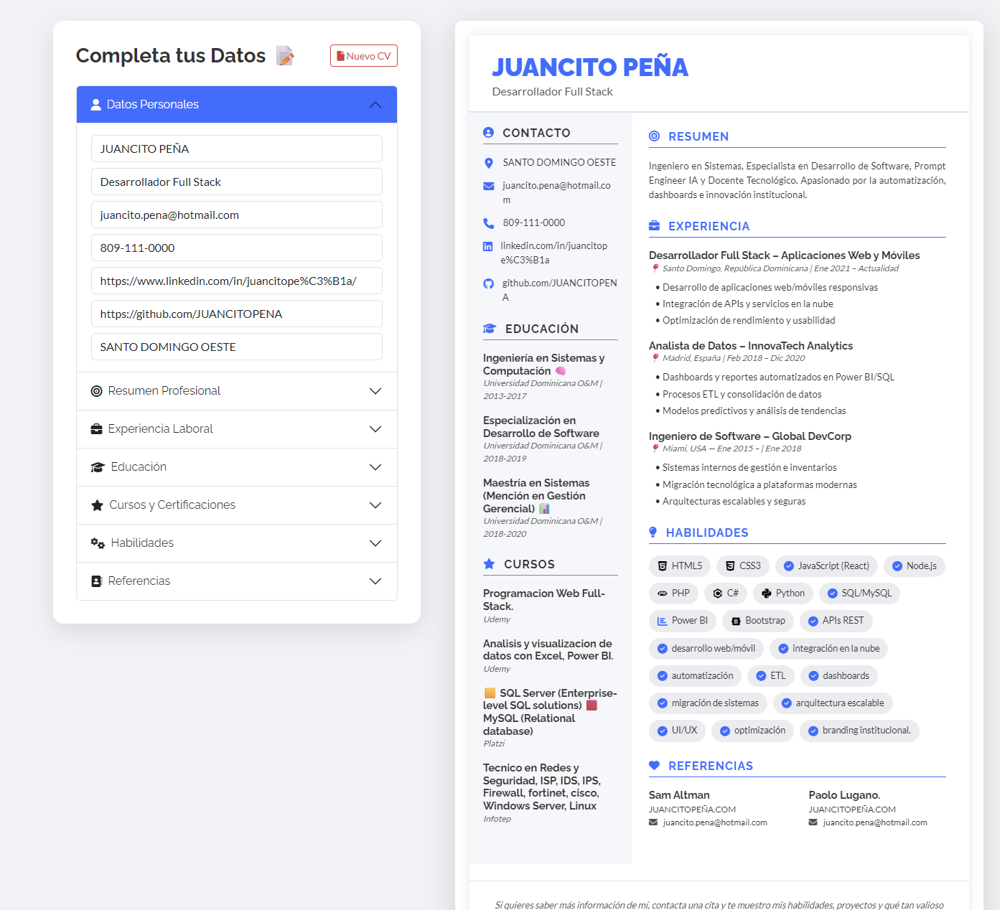

# CV Genius 📄✨

¡Bienvenido a **CV Pro**! Una herramienta de código abierto diseñada para empoderar a profesionales, estudiantes y cualquier persona en búsqueda de oportunidades, permitiéndoles crear currículums de alto impacto de forma rápida, visual y completamente gratuita.

**[➡️ Ver Demo en Vivo (Enlace a tu sitio web aquí)](#)**

---

 

---

## ¿Por qué usar CV Genius? 🤔

En un mercado laboral competitivo, un buen CV es tu mejor carta de presentación. CV Genius elimina las barreras técnicas y económicas, ofreciendo una solución intuitiva con características de nivel profesional:

*   ✍️ **Editor en Tiempo Real:** Mira cómo tu CV cobra vida mientras escribes. Sin sorpresas, lo que ves es lo que obtienes.
*   📄 **Exportación a PDF Inteligente:** Genera un PDF de alta calidad con un solo clic. El sistema ajusta automáticamente el formato del papel (Carta a Oficio/Legal) para que tu contenido siempre quepa perfectamente en una sola página.
*   💾 **Persistencia Local:** ¿Necesitas un descanso? Tu borrador se guarda automáticamente en tu navegador. Además, puedes guardar múltiples versiones de tu CV en un historial local para editarlos más tarde.
*   📱 **Diseño Responsivo:** Usa la herramienta cómodamente desde tu computadora, tablet o teléfono móvil.
*   🎨 **Iconografía Automática:** ¡Haz que tu sección de habilidades destaque! El sistema reconoce tecnologías como React, Python, SQL, etc., y añade sus logos automáticamente.
*   🚫 **Sin Registros, Sin Costos, Sin Publicidad:** Tu privacidad y tu tiempo son importantes. La herramienta es 100% gratuita y funciona directamente en tu navegador.

---

## Nuestro Aporte a la Comunidad 💖

La misión de CV Genius va más allá de ser solo una herramienta; es un proyecto con un fuerte propósito educativo y social.

### 🎓 Para Estudiantes y Buscadores de Empleo
Ofrecemos una herramienta gratuita y accesible que ayuda a derribar una de las primeras barreras para entrar al mercado laboral: la creación de un CV profesional. Empoderamos a los usuarios para que presenten sus habilidades y experiencias de la mejor manera posible, sin necesidad de conocimientos de diseño o de pagar por software costoso.

### 💻 Para Desarrolladores y Entusiastas de la Tecnología
Este proyecto sirve como un caso de estudio práctico y de código abierto sobre cómo integrar diversas tecnologías front-end para construir una aplicación web funcional y útil. Los desarrolladores pueden aprender sobre:

*   Manipulación del DOM con JavaScript puro (Vanilla JS).
*   Manejo de estado y persistencia de datos con `localStorage`.
*   Integración de librerías de terceros como `jsPDF` y `html2canvas` para generar documentos.
*   Implementación de un diseño responsivo con Bootstrap 5 y CSS moderno.
*   Buenas prácticas de desarrollo de software en un proyecto del mundo real.

---

## Tecnologías Utilizadas 🛠️

CV Genius está construido con un stack de tecnologías front-end modernas, robustas y ampliamente utilizadas en la industria.

*   **Lenguajes Base:**
    *   
    *   
    *   

*   **Frameworks y Librerías de Estilo:**
    *    - Para una maquetación responsiva y componentes UI.
    *    - Para la iconografía general de la interfaz.
    *    - Para los logos de las tecnologías en la sección de habilidades.

*   **Funcionalidad y Exportación:**
    *   **jsPDF:** Para la creación y manipulación de archivos PDF en el cliente.
    *   **html2canvas:** Para capturar el contenido del DOM como una imagen (canvas), que luego se inserta en el PDF.

---

## ¡Únete al Proyecto! 🤝

¡Tu colaboración es bienvenida! Si tienes ideas para mejorar CV Genius, has encontrado un error o quieres añadir una nueva funcionalidad, no dudes en participar.

### ¿Cómo Colaborar?
1.  **Haz un Fork** del repositorio.
2.  Crea una nueva rama para tu funcionalidad: `git checkout -b feature/nombre-de-la-mejora`.
3.  Realiza tus cambios y haz commits descriptivos.
4.  **Haz un Push** a tu rama: `git push origin feature/nombre-de-la-mejora`.
5.  Abre un **Pull Request** hacia la rama `main` del repositorio original.

### Ideas para Contribuir
*   ✨ **Nuevas Plantillas de CV:** Añadir más diseños y estilos de currículum.
*   🌐 **Internacionalización (i18n):** Traducir la interfaz a otros idiomas.
*   ♿ **Mejoras de Accesibilidad (a11y):** Asegurar que la herramienta sea usable por personas con discapacidades.
*   🧩 **Más Iconos de Habilidades:** Expandir el diccionario de tecnologías reconocidas.
*   🧪 **Pruebas Unitarias:** Añadir tests para asegurar la estabilidad del código.

---

## Licencia 📄

Este proyecto está bajo la Licencia MIT. Consulta el archivo `LICENSE` para más detalles.

Creado con ❤️ para la comunidad.
